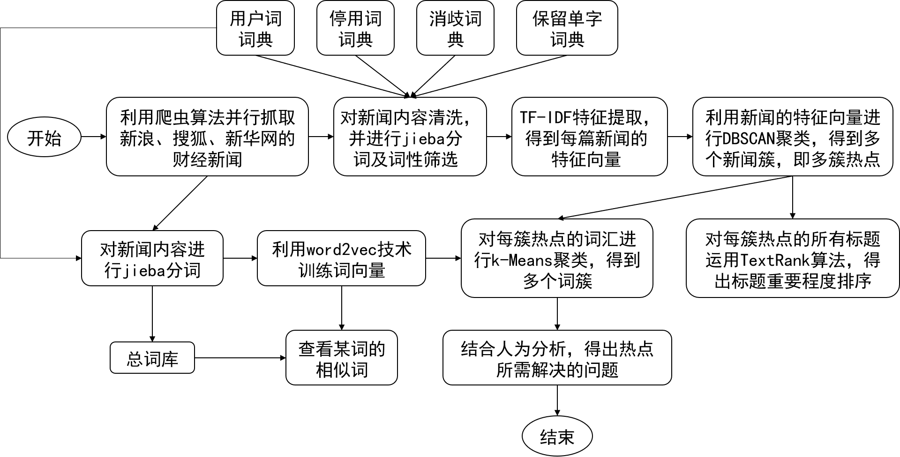
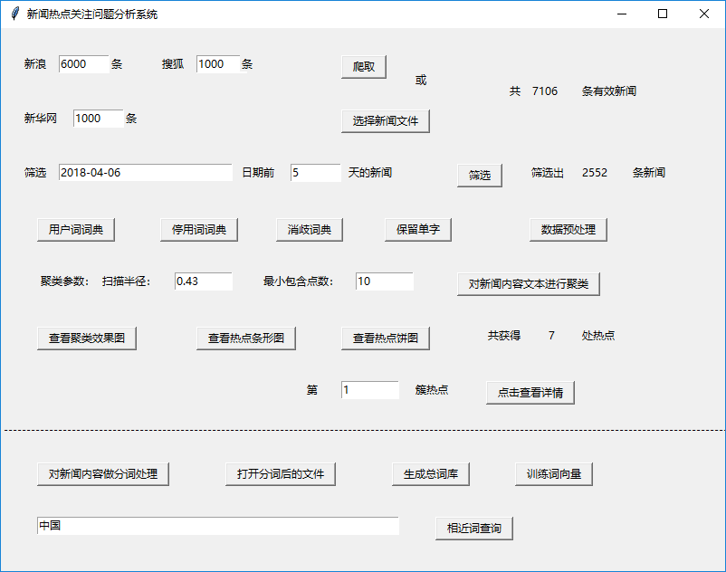

# HotNewsAnalysis
利用文本挖掘技术进行新闻热点关注问题分析

------
## 热点分析

本文主要通过文本挖掘技术进行新闻热点问题分析，把从网上抓取到的财经新闻，通过对新闻内容的聚类，得到新闻热点；再对热点进行分析，通过对某一热点相关词汇的聚类，得到热点问题所涉及的人物、行业或组织等。主要涵盖的内容如图1-1所示：

    

    图 1-1 新闻热点关注问题分析总任务

由图1-1所见，本文主要研究的内容为：

 1. 利用新闻API、爬虫算法、多线程并行技术，抓取三大专业财经新闻网站（新浪财经、搜狐财经、新华网财经）的大量财经新闻报道；

 2. 对新闻进行去重、时间段过滤，然后对新闻内容文本进行jieba分词并词性标注，过滤出名词、动词、简称等词性，分词前使用自定义的用户词词典增加分词的准确性，分词后使用停用词词典、消歧词典、保留单字词典过滤掉对话题无关并且影响聚类准确性的词，建立每篇新闻的词库，利用TF-IDF特征提取之后对新闻进行DBSCAN聚类，并对每个类的大小进行排序；

 3. 针对聚类后的每一类新闻，为了得到该处热点的话题信息，还需要提取它们的标题，利用TextRank算法，对标题的重要程度进行排序，用重要性最高的标题来描述该处热点的话题；

 4. 对所有的新闻内容进行jieba分词，并训练出word2vec词嵌入模型，然后对聚类后的每一类新闻，提取它们的内容分词后的结果，运用word2vec模型得到每个词的词向量，再利用k-Means聚类算法进行相近词聚类。

系统界面可视化如图1-2所示：

    

    图 1-2 新闻热点关注问题分析系统总界面

功能：见[paper](./paper/利用文本挖掘技术进行新闻热点关注问题分析.pdf)
